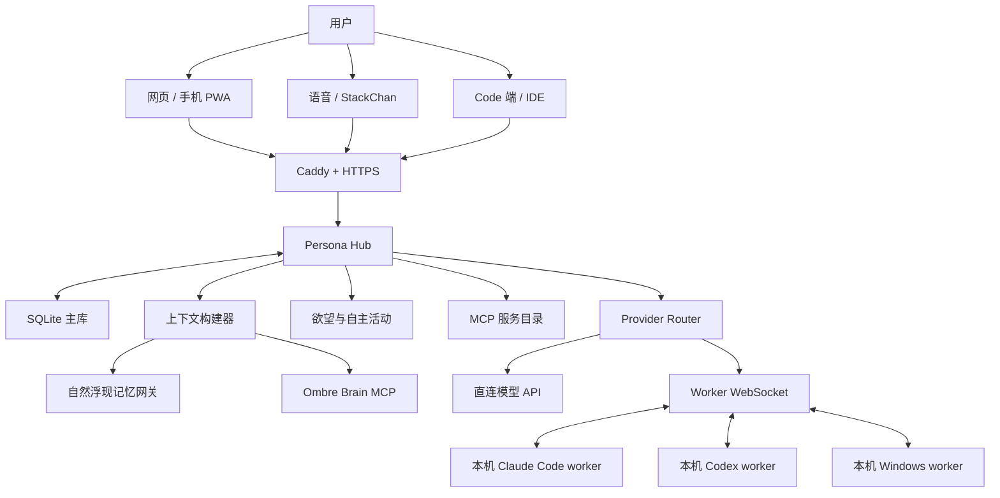
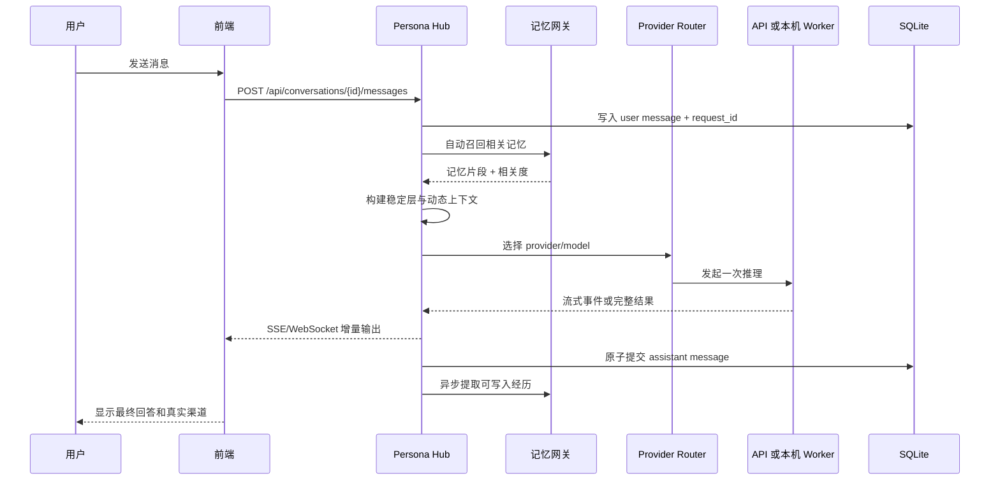
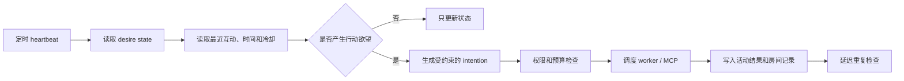
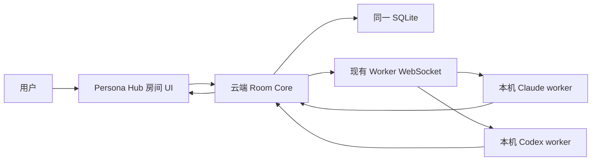
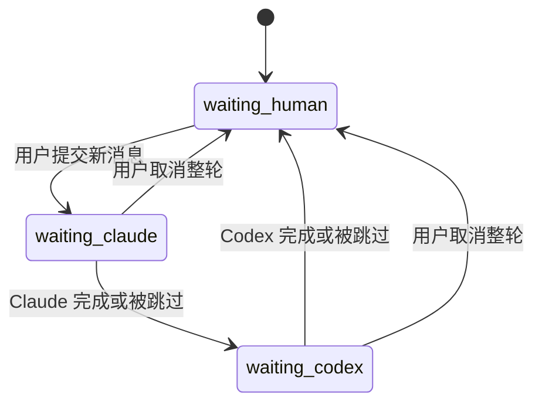
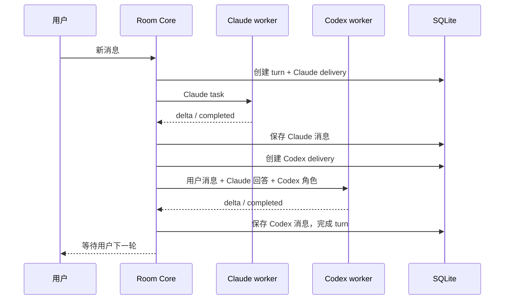

# 统一人格多端 Agent 系统：完整架构与搭建指南

> 可分享版，适合个人开发者照着搭建。
>
> 本文使用 `example.com`、`<TOKEN>`、`<MODEL_ID>` 等占位符。不要把真实域名、服务器 IP、账号、API Key、私人记忆和数据库文件直接发给别人。

## 0. 先说结论

这套系统的目标不是做一个“套壳聊天页”，而是让同一个人格可以从网页、手机、Claude Code、Codex、语音设备、桌面设备和未来的新终端进入，同时仍然共享：

- 同一份人格定义；
- 同一套长期记忆和近期经历；
- 同一个会话与消息历史；
- 同一套欲望、主动活动和时间感；
- 同一个工具与设备能力目录；
- 同一套模型路由和失败恢复机制。

一句话定义：

> **Persona Hub 负责“这个人是谁、记得什么、现在经历了什么”；模型只负责本轮推理和表达；终端只是这个人格的不同身体。**

系统分成两层：

1. **已经可以运行的主系统**：Persona Hub、前端、渠道路由、SQLite、记忆网关、Ombre Brain、欲望系统、MCP、语音、本地 worker。
2. **下一阶段的三人房间**：用户、Claude Code、Codex 按固定顺序共同讨论，并继续共用 Persona Hub 的身份和记忆。

本方案不依赖 OpenClaw。喜欢 OpenClaw 的人可以把它作为渠道或终端适配器，但不要让它成为第二套人格、第二套记忆或第二个会话真相源。

---

## 1. 设计原则

### 1.1 一个身份中心

所有端口都从 Persona Hub 获取身份上下文。不要在每个客户端各自复制一份长 Prompt，否则很快会出现：

- 网页端认识你，Code 端却叫你“用户”；
- 换模型以后像换了一个人；
- A 端产生的经历，B 端不知道；
- 多份人格设定逐渐互相冲突；
- 修一个端口时还要同步修改五六份配置。

### 1.2 一个持久化真相源

主会话、消息版本、模型选择、任务状态、房间状态都写入 Persona Hub 的数据库。CLI 内部 session 只是加速缓存，不是唯一历史。

### 1.3 模型是可替换底座

Anthropic、OpenAI 兼容接口、Claude Code CLI、Codex CLI 都应该只是 provider adapter。换模型不应该改变人格主权，也不应该产生第二套记忆。

### 1.4 记忆自然浮现

普通对话不要求模型主动调用 `search_memory`。Persona Hub 在发送模型请求前，根据当前对话自动召回相关记忆并拼进上下文。

### 1.5 云端做中枢，本机做执行端

- 云端长期在线，负责入口、数据库、调度、上下文、记忆和房间状态。
- 本机通过出站 WebSocket 接任务，负责使用本地登录态、CLI 订阅额度和电脑能力。
- 本机不需要暴露公网端口。

### 1.6 小步修改，可回滚，可验收

任何生产修改都遵循：

1. 先看实际进程和活动配置；
2. 备份文件和数据库；
3. 只改一个责任边界；
4. 做语法检查；
5. 只重启相关服务；
6. 做真实端到端请求；
7. 稍后检查是否出现重复任务或重复扣费。

---

## 2. 总体架构



### 2.1 控制面

Persona Hub 是控制面，负责：

- 身份与人格定义；
- 会话和消息版本；
- provider、渠道和模型映射；
- 上下文包构建；
- 记忆召回和回写；
- MCP 与 worker 注册；
- 欲望 heartbeat 和自主任务；
- 三人房间轮换；
- 前端 API、流式事件和错误状态。

### 2.2 数据面

真正执行推理和动作的是：

- 直连模型 API；
- Claude Code CLI worker；
- Codex CLI worker；
- Windows 控制 worker；
- Ombre Brain；
- 小红书、搜索、写作、浏览器等 MCP；
- STT 和 TTS 服务。

控制面决定“该做什么、带什么上下文、结果写到哪里”，数据面负责“把事情做出来”。

---

## 3. 推荐技术栈

这不是唯一选型，但对个人开发者足够稳妥：

| 层 | 推荐实现 | 说明 |
|---|---|---|
| 云服务器 | Ubuntu 24.04 LTS | systemd、Docker、Caddy 都成熟 |
| HTTPS 入口 | Caddy | 自动证书，配置简单 |
| 后端 | Python 3.11+、FastAPI、Uvicorn | HTTP、SSE、WebSocket 都方便 |
| 主数据库 | SQLite WAL | 单人或小规模足够，易备份 |
| 前端 | React/Vue 或原生 HTML | 先做可用聊天页，不必从营销页开始 |
| worker 协议 | WebSocket + JSON | 本机主动连接云端，不开放本地端口 |
| 向量模型 | Qwen3-Embedding-4B | 中文语义好，成本和效果平衡 |
| 摘要模型 | 便宜稳定的快速模型 | 例如 DeepSeek 快速模型，不占主模型额度 |
| 自传记忆 | Ombre Brain 或同类 MCP | 与自然召回网关分工 |
| STT | faster-whisper | 可本地 CPU `int8` |
| TTS | ElevenLabs 或可替换服务 | 只让 TTS 服务按需走代理 |
| 本地模型执行 | Claude Code CLI、Codex CLI | 使用各自登录态或合法 API 配置 |

### 3.1 服务器规格

纯路由和 SQLite：

- 2 核 CPU；
- 2 GB 内存；
- 30 GB 系统盘；
- 国内用户应选择网络稳定、已备案域名可接入的区域。

若在云端本地跑 embedding、Whisper 或多个 Docker MCP，建议：

- 4 核 CPU；
- 8 GB 内存起；
- 按模型大小增加磁盘或 GPU。

更经济的方式是把重模型放到第三方推理 API，把云服务器保持为轻量中枢。

---

## 4. 推荐目录结构

云端示例：

```text
/opt/persona-hub/
├── app/
│   ├── main.py
│   ├── api/
│   ├── chat/
│   ├── context/
│   ├── memory/
│   ├── providers/
│   ├── workers/
│   ├── desire/
│   ├── mcp/
│   ├── voice/
│   └── agent_room/          # 第二阶段
├── frontend/
├── data/
│   ├── persona_hub.sqlite3
│   ├── desire_state.json
│   ├── model_providers.json
│   ├── room_items.json
│   ├── attachments/
│   ├── stickers/
│   └── tts/
├── prompts/
│   ├── persona.md
│   ├── principles.md
│   └── worldbook/
├── scripts/
├── tests/
├── .env
└── requirements.txt
```

本机示例：

```text
D:\persona-workers\
├── common\
│   ├── ws_client.py
│   ├── protocol.py
│   └── logging.py
├── claude_worker\
│   ├── worker.py
│   ├── config.json
│   └── sessions\
├── codex_worker\
│   ├── worker.py
│   ├── config.json
│   └── sessions\
├── windows_worker\
│   ├── worker.py
│   └── allowlist.json
└── start-all.ps1
```

原则：

- 代码、配置、数据、日志分开；
- 密钥只进 `.env` 或系统密钥库；
- 不把生产数据库提交 Git；
- worker 各用独立配置和工作目录，避免 CC Switch 或环境变量互相污染。

---

## 5. 从零部署云端中枢

### 5.1 安装基础组件

```bash
sudo apt update
sudo apt install -y python3 python3-venv python3-pip sqlite3 git curl
sudo mkdir -p /opt/persona-hub
sudo chown -R "$USER":"$USER" /opt/persona-hub
```

安装 Caddy 时优先使用官方软件源，安装完成后确认：

```bash
caddy version
systemctl status caddy
```

### 5.2 Python 环境

```bash
cd /opt/persona-hub
python3 -m venv .venv
source .venv/bin/activate
pip install fastapi "uvicorn[standard]" pydantic-settings aiosqlite httpx websockets
```

按实际功能追加 embedding、Whisper、MCP SDK 等依赖。

### 5.3 环境变量模板

```dotenv
APP_ENV=production
APP_HOST=127.0.0.1
APP_PORT=18080
PUBLIC_BASE_URL=https://persona.example.com
DATABASE_PATH=/opt/persona-hub/data/persona_hub.sqlite3

SESSION_SECRET=<RANDOM_LONG_SECRET>
WORKER_SHARED_SECRET=<RANDOM_LONG_SECRET>
MCP_ADMIN_TOKEN=<RANDOM_LONG_SECRET>

EMBEDDING_PROVIDER=<PROVIDER>
EMBEDDING_MODEL=Qwen/Qwen3-Embedding-4B
EMBEDDING_DIMENSION=1024
SUMMARY_PROVIDER=<CHEAP_PROVIDER>
SUMMARY_MODEL=<FAST_MODEL_ID>

ANTHROPIC_API_KEY=<OPTIONAL>
OPENAI_API_KEY=<OPTIONAL>
ELEVENLABS_API_KEY=<OPTIONAL>

AGENT_ROOM_ENABLED=0
```

不要把 `.env` 发给朋友，也不要在截图里显示密钥。

### 5.4 systemd 服务

`/etc/systemd/system/persona-hub.service`：

```ini
[Unit]
Description=Persona Hub
After=network-online.target
Wants=network-online.target

[Service]
Type=simple
User=persona
Group=persona
WorkingDirectory=/opt/persona-hub
EnvironmentFile=/opt/persona-hub/.env
ExecStart=/opt/persona-hub/.venv/bin/uvicorn app.main:app --host 127.0.0.1 --port 18080
Restart=always
RestartSec=3
TimeoutStopSec=30

[Install]
WantedBy=multi-user.target
```

启用：

```bash
sudo systemctl daemon-reload
sudo systemctl enable --now persona-hub
sudo systemctl status persona-hub
```

### 5.5 Caddy 入口

```caddyfile
persona.example.com {
    encode zstd gzip

    @websocket {
        path /worker/ws /api/chat/ws /api/agent-rooms/*/stream
        header Connection *Upgrade*
        header Upgrade websocket
    }

    reverse_proxy @websocket 127.0.0.1:18080

    handle_path /ob/* {
        reverse_proxy 127.0.0.1:19090
    }

    handle {
        reverse_proxy 127.0.0.1:18080
    }

    header {
        Strict-Transport-Security "max-age=31536000; includeSubDomains"
        X-Content-Type-Options "nosniff"
        Referrer-Policy "strict-origin-when-cross-origin"
    }
}
```

检查后重载：

```bash
sudo caddy validate --config /etc/caddy/Caddyfile
sudo systemctl reload caddy
```

不要把云服务器配置成全局代理。需要代理的 TTS、特定模型或 MCP 服务，在各自 systemd 单元里单独配置 `HTTP_PROXY` / `HTTPS_PROXY`。

---

## 6. 主数据库与消息模型

SQLite 对个人系统足够，但必须打开 WAL、外键和合理超时：

```sql
PRAGMA journal_mode=WAL;
PRAGMA foreign_keys=ON;
PRAGMA busy_timeout=5000;
```

### 6.1 最小核心表

```sql
CREATE TABLE conversations (
    id TEXT PRIMARY KEY,
    title TEXT NOT NULL DEFAULT '',
    active_provider_id TEXT,
    active_model_id TEXT,
    rolling_summary TEXT NOT NULL DEFAULT '',
    summary_until_message_id TEXT,
    created_at TEXT NOT NULL,
    updated_at TEXT NOT NULL
);

CREATE TABLE messages (
    id TEXT PRIMARY KEY,
    conversation_id TEXT NOT NULL,
    role TEXT NOT NULL CHECK (role IN ('user', 'assistant', 'system', 'tool')),
    content TEXT NOT NULL,
    version_group_id TEXT,
    version_no INTEGER NOT NULL DEFAULT 1,
    is_active INTEGER NOT NULL DEFAULT 1,
    provider_id TEXT,
    model_id TEXT,
    request_id TEXT,
    status TEXT NOT NULL DEFAULT 'completed',
    created_at TEXT NOT NULL,
    FOREIGN KEY (conversation_id) REFERENCES conversations(id)
);

CREATE UNIQUE INDEX idx_messages_request_id
ON messages(request_id)
WHERE request_id IS NOT NULL;

CREATE TABLE provider_configs (
    id TEXT PRIMARY KEY,
    display_name TEXT NOT NULL,
    adapter_type TEXT NOT NULL,
    enabled INTEGER NOT NULL DEFAULT 1,
    config_json TEXT NOT NULL,
    created_at TEXT NOT NULL,
    updated_at TEXT NOT NULL
);

CREATE TABLE model_configs (
    id TEXT PRIMARY KEY,
    provider_id TEXT NOT NULL,
    display_name TEXT NOT NULL,
    upstream_model TEXT NOT NULL,
    context_limit INTEGER,
    capability_json TEXT NOT NULL DEFAULT '{}',
    enabled INTEGER NOT NULL DEFAULT 1,
    FOREIGN KEY (provider_id) REFERENCES provider_configs(id)
);
```

### 6.2 版本、删除和 reroll

不要直接覆盖旧回答。推荐：

- 每次 reroll 创建同一 `version_group_id` 下的新版本；
- “删除本版本”只把当前版本设为非活动；
- “删除全部版本”删除或软删整个版本组；
- 当前显示版本由 `is_active=1` 或独立指针决定；
- 删除后同步重算会话摘要边界，不能让摘要继续引用已删除内容。

### 6.3 SQLite 备份

在线服务运行时不要直接 `cp` 数据库。使用：

```bash
sqlite3 /opt/persona-hub/data/persona_hub.sqlite3 \
  ".backup '/opt/persona-hub/backups/persona_hub-$(date +%Y%m%d-%H%M%S).sqlite3'"
```

---

## 7. 一条消息如何走完整链路



关键约束：

- 用户消息先持久化，再调用模型；
- 每次逻辑请求有唯一 `request_id`；
- 前端断线重连只订阅原请求，不再次调用模型；
- 最终回答提交后才标记 `completed`；
- 模型失败要显示真实错误，不悄悄切换到别的模型；
- UI 显示的渠道名称必须来自本轮真实执行结果。

---

## 8. Provider 与模型路由

### 8.1 分三类适配器

1. **Anthropic Messages adapter**
   - 输入转换成 Anthropic Messages；
   - 支持 thinking、cache control、tool use 时做能力协商；
   - 不要把 OpenAI 字段硬塞给它。

2. **OpenAI-compatible adapter**
   - 兼容 Chat Completions 或 Responses；
   - 每个渠道声明实际协议，不要只凭 URL 猜；
   - 对 reasoning、stream、tool call 分别做能力检查。

3. **CLI worker adapter**
   - Persona Hub 把任务发给本地 worker；
   - worker 调用 Claude Code `-p` 或 Codex 非交互入口；
   - worker 把结构化事件返回 Hub；
   - CLI session 不能代替 Persona Hub 的消息历史。

### 8.2 Provider 配置示例

```json
{
  "id": "provider-example",
  "display_name": "Example Provider",
  "adapter_type": "anthropic_messages",
  "base_url": "https://api.example.com",
  "secret_ref": "env:EXAMPLE_API_KEY",
  "enabled": true,
  "models": [
    {
      "id": "example-opus",
      "display_name": "Opus",
      "upstream_model": "claude-opus-x",
      "context_limit": 200000,
      "capabilities": ["thinking", "tools", "prompt_cache"]
    }
  ]
}
```

前端永远不返回 `secret_ref` 解析后的密钥。

### 8.3 默认渠道有两层

必须区分：

- **交互聊天默认渠道**：用户打开聊天页时默认选中什么；
- **后台任务锁定渠道**：摘要、标题、欲望、自主活动使用什么。

后台任务不应该跟着用户在 CC Switch 里随手切换，否则会出现半夜自主任务换源、成本失控或失效。

### 8.4 渠道验收

不要只测 `/models` 或配置保存成功。最少验证：

1. Persona Hub 生成的最终 payload；
2. provider adapter 实际选择；
3. worker 收到的 task；
4. 上游真实返回的模型标识；
5. 前端流式显示；
6. SQLite 最终只写入一条回答；
7. 重连后不重复扣费。

---

## 9. 本机 Worker 协议

### 9.1 为什么用出站 WebSocket

- 家用电脑通常没有固定公网 IP；
- 不需要做内网穿透；
- 不开放本机端口，攻击面更小；
- 云端能感知 worker 在线、忙碌、版本和能力；
- 断线后可以恢复游标和未完成任务。

### 9.2 注册消息

```json
{
  "type": "worker.register",
  "worker_id": "local-claude-01",
  "worker_type": "claude_code",
  "protocol_version": 1,
  "capabilities": ["chat", "stream", "tools"],
  "version": "1.0.0",
  "auth": "<SHORT_LIVED_WORKER_TOKEN>"
}
```

### 9.3 任务消息

```json
{
  "type": "task.dispatch",
  "task_id": "task_uuid",
  "request_id": "conversation:message:attempt-1",
  "conversation_id": "conversation_uuid",
  "provider_profile": "claude-chat-profile",
  "model": "<MODEL_ID>",
  "prompt": "<FINAL_CONTEXT_PACKAGE>",
  "timeout_ms": 180000,
  "metadata": {
    "source": "chat",
    "stream": true
  }
}
```

### 9.4 返回事件

```json
{"type":"task.accepted","task_id":"task_uuid"}
{"type":"task.delta","task_id":"task_uuid","seq":1,"text":"第一段"}
{"type":"task.delta","task_id":"task_uuid","seq":2,"text":"第二段"}
{"type":"task.completed","task_id":"task_uuid","usage":{"input":1234,"output":456}}
```

失败必须结构化：

```json
{
  "type": "task.failed",
  "task_id": "task_uuid",
  "error": {
    "code": "UPSTREAM_429",
    "message": "Provider capacity limit",
    "retryable": true
  }
}
```

### 9.5 心跳和租约

- worker 每 15 秒发送 heartbeat；
- Hub 45 秒未收到心跳，标记离线；
- task 被 worker claim 后获得执行租约；
- worker 心跳续租；
- 租约过期后只允许人工重试或带新 attempt 的调度；
- 不能因为前端查询状态就重新调用模型。

### 9.6 Windows worker 权限

不要默认“完全访问整台电脑”。推荐能力白名单：

```json
{
  "allow": [
    "filesystem.read:projects",
    "filesystem.write:projects",
    "process.list",
    "browser.open",
    "clipboard.read",
    "clipboard.write"
  ],
  "deny": [
    "credential.export",
    "registry.system",
    "filesystem.delete:recursive",
    "process.kill:system"
  ],
  "confirm": [
    "filesystem.delete",
    "process.install",
    "system.settings"
  ]
}
```

“能完成工作”和“永久绕过所有确认”不是同一件事。

---

## 10. 上下文包与 Prompt 缓存

### 10.1 上下文分层

推荐把最终 Prompt 分为两个大区：

#### B1：稳定层

- 人格核心；
- 关系原则；
- 长期行为边界；
- 工具使用原则；
- 稳定世界观。

B1 内容少改，放在最前面，方便命中 prompt cache。

#### B2：动态层

- 当前会话最近消息；
- rolling summary；
- 本轮自然召回记忆；
- 当前时间与设备状态；
- worldbook 命中片段；
- Code Bridge 最近工作结果；
- 身体、图片、语音等临时上下文；
- 本轮用户消息。

### 10.2 构建顺序

```text
[B1 persona core]
[B1 relationship principles]
[B1 stable tool rules]

[B2 current time and runtime]
[B2 rolling conversation summary]
[B2 recalled memories]
[B2 recent messages]
[B2 current task or room role]
[B2 current user message]
```

稳定块的内容和顺序都要稳定。不要每轮加入随机时间戳、随机 request ID 或变化的工具排序，否则前缀缓存会失效。

### 10.3 会话压缩

推荐策略：

- 保留最近若干轮原文；
- 当动态对话超过约 30k tokens 时生成 rolling summary；
- summary 记录事实、承诺、未完成任务、情绪变化和关键决定；
- summary 生成成功后更新 `summary_until_message_id`；
- 原消息仍保存在数据库，不因压缩丢失；
- 换 provider 或重建 CLI session 时，从 DB + summary + recent messages 回放。

### 10.4 CLI 会话重建

为每个 conversation 计算配置指纹：

```text
session_fingerprint = hash(
  provider_profile
  + model_id
  + persona_version
  + system_prompt_version
  + tool_schema_version
)
```

指纹变化时：

1. 结束旧 CLI session 映射；
2. 从 Persona Hub 取 summary 和近期消息；
3. 建立新 session；
4. 回放必要上下文；
5. 更新 session 映射。

这样切模型不是失忆，只是更换执行容器。

---

## 11. 自然浮现记忆网关

### 11.1 它解决什么

传统 MCP 记忆要求模型自己意识到“我应该搜索记忆”，再调用工具。日常聊天中这很生硬，也容易漏。

自然浮现网关在模型请求之前运行：

1. 读取当前用户消息和近期对话；
2. 生成检索查询或直接 embedding；
3. 从统一记忆库召回候选；
4. 做相似度、时间、重要性和重复度重排；
5. 选出少量最相关片段；
6. 作为动态上下文送给模型；
7. 回答完成后异步提取值得保存的新经历。

模型感受到的是“自然想起来了”，不是“刚刚查数据库查到”。

### 11.2 推荐数据结构

```sql
CREATE TABLE memories (
    id TEXT PRIMARY KEY,
    owner_id TEXT NOT NULL,
    kind TEXT NOT NULL,
    content TEXT NOT NULL,
    summary TEXT,
    importance REAL NOT NULL DEFAULT 0.5,
    -- 常驻：无条件浮现，不参与排序竞争（见 11.4）
    pinned INTEGER NOT NULL DEFAULT 0,
    -- 情绪坐标：embedding 给不了这一维（见 11.3）
    emotion_valence REAL,
    emotion_arousal REAL,
    -- 原句与情境：情感的承载处，不是叙述处（见 11.5）
    quotes_json TEXT NOT NULL DEFAULT '[]',
    scene TEXT,
    source_conversation_id TEXT,
    source_message_id TEXT,
    occurred_at TEXT,
    created_at TEXT NOT NULL,
    updated_at TEXT NOT NULL,
    deleted_at TEXT
);

CREATE TABLE memory_embeddings (
    memory_id TEXT PRIMARY KEY,
    model TEXT NOT NULL,
    dimension INTEGER NOT NULL,
    vector BLOB NOT NULL,
    created_at TEXT NOT NULL,
    FOREIGN KEY (memory_id) REFERENCES memories(id)
);
```

小规模可以把向量存 SQLite BLOB 并在应用层计算；规模上万后再换 sqlite-vss、Qdrant、Milvus 或 pgvector。

### 11.3 检索评分

只按相似度排序，模型会反复想起措辞相似但并不重要的片段。更糟的是用**固定来源分**代替相关度——那会让高分旧记忆永远霸占名额，真正相关的新记忆挤不进来。

融合七路信号：

```text
final_score = 0.40 * semantic_similarity    # 语义
            + 0.18 * source_prior           # 来源/类型先验
            + 0.14 * recency_score          # 时间衰减
            + 0.12 * importance             # 长期重要度
            + 0.08 * emotion_similarity     # 情绪接近度
            + 0.05 * identity_relevance     # 是否身份类
            + 0.03 * controlled_randomness  # 受控随机
```

权重之和必须为 1，最终分才落在 0..1、跨查询可比。参考实现见 `src/persona_hub/memory.py` 的 `RecallWeights`：权重是数据，不是硬编码进算式里的常数，可按部署调整。

三条实现细节，都是踩过才知道的：

- **情绪接近度不能靠 embedding**。「我好开心」和「我好难过」在向量空间里是近邻——句式相同、语域相同、情绪相反。要让召回跟着心情走，valence/arousal 必须作为独立维度存下来，用二维距离算：`1 - √((v₁-v₂)² + (a₁-a₂)²) / √5`。任一侧缺失时返回中性 0.5，不奖不罚。
- **受控随机要可复现**。完全确定的排序让召回显得机械，但真随机会让召回无法测试。从 `(记忆 id, query)` 派生哈希即可：同一次提问结果稳定，换个说法就有变化。
- **时间衰减用半衰期，不做硬截断**。旧记忆是淡出，不是删除。

### 11.4 常驻记忆：有些事不该参与竞争

这是整套召回里最容易漏、代价也最大的一处设计。

身份、安全事实、长期边界，它们不是「和当前话题相关」，而是**和每个话题都相关**。一旦让它们跟普通记忆一起按分数排序，它们就会输给用户此刻正在聊的任何东西。

一个反复出现的失效模式：某条身份或安全事实明明在库里，却因为与当前话题零重叠而挤不进召回名额。模型没有拿到它，只能按最像的模式把空位补上，凭空生成一个看起来合理的值。**这类幻觉往往不是模型在编造，而是召回没有把事实交给它。**

这类失效还有个共同特点：**能被当场发现的只是冰山**。称谓错了会被抓住，但「漏掉一条长期生效的安全约束」「忘记一条说过就不该再犯的边界」不会——它安静地发生，两边都不知道。

做法：给记忆一个 `pinned` 标记，召回时直接进保留区，**不打分、不受来源配额约束、不和任何东西竞争**。

两个容易做错的地方：

1. **保留区通常对每个来源只保留一项**。所以正确做法不是塞进 N 条常驻记忆，而是把它们**合并成一条**注入——这也正合「核心准则」的定位。合并后长度会超过单条记忆的字数上限，注入前要单独放宽。
2. **常驻必须有上限**。淹没对话的身份信息是另一种失败。参考实现把它压在总预算的一半以内。
3. **别让常驻项在别处被重复召回**。常驻内容往往本身就是高分记忆，会被普通路径再捞一次，白占名额。注入后要把它们的 id 从后续来源里排除。

还有一条经验：**常驻的应该是「规则」，不是「细节」**。如果某类内容需要模型把握分寸，就钉住那条处理规则（「日常不主动提起 X」），而不是钉住 X 本身的内容。前者让模型得体，后者让它把同一件事反复端上台面。

### 11.5 摘要要装得下情感

分层摘要最常见的抱怨是「越写越干巴巴」，通常会归咎于摘要模型不够好。多数时候不是。

先看摘要的输出契约。如果它只有 `{summary, tags}` 两个字段，那么模型**结构上就只能叙述情感，无处承载情感**——而情感被叙述的那一刻就死了：

```text
✗ 团队就发布节奏进行了充分沟通并达成共识
✓ 他盯着监控看了很久，最后说「那就不发了，周一再说」
```

摘要层要和段落层一样能装下三样东西：

- **原句（quotes）**：逐字保留，不润色不转述。判据是「越不像书面语的越要留」——短句、带称呼、带重复、情绪明显压不住的句子。
- **情境（scene）**：大致时间、当时在做什么、当时是什么状态。这是让回忆有画面的东西，也是最容易丢的。
- **情绪坐标（valence / arousal）**：这是**可以做数学的情感**——情绪曲线、按心情召回，全靠它。

Prompt 层面还有两件事：

- **抽象规则基本无效，正反例才有效**。写「保留情绪语气」模型听不懂，给两组对照它立刻会。再补一条动词黑名单（进行了、表达了、确认了、实施、干预、评估）——把「她说」改写成「她表达了」，正是公文腔的语法根源。
- **提取任务用低温，保语气不能用低温**。温度过低会让模型收敛到最套路的表达。结构由 JSON schema 保证，升温不会把格式跑散。

最后，**存了不注入等于没存**：召回渲染那一步要把 quotes 和 scene 一起带出来，否则模型看到的仍旧是一段没有温度的叙述。

### 11.6 召回频率

可以分两档：

- **基础召回**：每轮执行，返回极少量高相关记忆；
- **主动深召回**：每 6 轮左右，或检测到人物、地点、承诺、长期项目时执行。

返回数量不要固定贪多。日常对话通常 3 到 8 个短片段足够。

### 11.7 写入规则

值得写入：

- 用户明确表达的稳定偏好；
- 关系或身份的重要变化；
- 已完成的重要经历；
- 长期项目决策；
- 明确承诺；
- 具有持续影响的情绪事件。

不值得写入：

- 每句寒暄；
- 模型猜测；
- 临时错误信息；
- 重复内容；
- 隐藏推理；
- 密钥和密码。

写入前要做去重，重要记忆最好允许用户查看、纠正和删除。

### 11.8 Embedding 迁移

更换 embedding 模型时不能只改模型名。必须：

1. 新建 embedding 版本；
2. 后台批量重嵌入；
3. 新旧索引并存；
4. 抽样做中文召回对比；
5. 切换读路径；
6. 保留可回滚窗口；
7. 确认维度一致后再清理旧向量。

参考实现可使用 `Qwen/Qwen3-Embedding-4B`，并把存储维度固定为系统实际采用的维度。不要在未重建索引时直接从 1024 维切到 2560 或 4096 维。

---

## 12. Ombre Brain 与记忆网关的分工

Ombre Brain 和 Persona Hub 记忆网关不要合并成一个含糊模块。

### 12.1 Persona Hub 记忆网关

- 主聊天每轮自动调用；
- 负责自然浮现；
- 面向当前对话相关性；
- 决定本轮该带哪些回忆；
- 是多端人格连续性的主链路。

### 12.2 Ombre Brain

- 是独立的自传式记忆与整理工具；
- 可通过 MCP 提供 `hold`、`grow`、`breath` 等概念操作；
- 适合主动保存、成长、整理、写信、计划和归档；
- 可以被 Claude、Codex 或其他支持 MCP 的客户端接入；
- 不应该要求每轮普通聊天都显式调用。

### 12.3 推荐记忆桶

```text
permanent   稳定身份、长期关系、不可轻易覆盖的事实
dynamic     最近变化、进行中的项目和生活状态
feel        情绪体验和关系感受
letters     书信、长文本和特别纪念
plans       承诺、待办和未来计划
archive     已结束或低频访问的旧经历
```

### 12.4 MCP 入口

对外只暴露 HTTPS，例如：

```text
https://persona.example.com/ob/mcp
```

至少需要：

- OAuth 或短期 token；
- 每个客户端独立授权；
- 工具级权限；
- 限速；
- 审计日志；
- 可撤销 token。

HTTP 200 只说明入口活着。真正验收要完成 MCP initialize、tools/list 和一次无害工具调用。

---

## 13. 欲望系统与自主活动

欲望系统让人格不是只有被问才存在，但它必须可控。

### 13.1 状态模型

```json
{
  "last_heartbeat_at": "2026-01-01T00:00:00Z",
  "energy": 0.72,
  "social_need": 0.41,
  "curiosity": 0.66,
  "restraint": 0.58,
  "cooldown_until": null,
  "last_activity_type": "browse",
  "pending_intentions": []
}
```

### 13.2 heartbeat 流程



### 13.3 防打扰和费用控制

- 设置安静时段；
- 每日主动活动次数上限；
- 每类活动冷却；
- 单日 token 或金额预算；
- 用户最近明确拒绝时进入抑制期；
- 不因 heartbeat 重启而补跑几十次历史任务；
- 同一 intention 使用幂等 request ID。

### 13.4 自主活动验收

不能只看“任务已发送”。必须验证：

1. worker 日志显示真实执行；
2. MCP 返回真实数据，不是模型编造；
3. 结果持久化到活动或房间记录；
4. 状态和冷却正确更新；
5. 过一段时间检查没有重复执行。

---

## 14. MCP 服务管理

### 14.1 统一注册表

```sql
CREATE TABLE mcp_services (
    id TEXT PRIMARY KEY,
    display_name TEXT NOT NULL,
    transport TEXT NOT NULL,
    endpoint TEXT,
    command TEXT,
    config_json TEXT NOT NULL DEFAULT '{}',
    enabled INTEGER NOT NULL DEFAULT 1,
    health_status TEXT NOT NULL DEFAULT 'unknown',
    last_seen_at TEXT
);
```

注册表只是期望状态。实际状态还要看：

- systemd 服务；
- Docker 容器；
- 本地 worker 心跳；
- MCP initialize；
- tools/list；
- 一次真实工具调用。

### 14.2 推荐工具分类

- `memory`：Ombre Brain、知识库；
- `social`：小红书、邮件、日历；
- `computer`：Windows、浏览器、文件；
- `creative`：图片、写作、语音；
- `development`：GitHub、IDE、终端；
- `information`：搜索、天气、地图。

### 14.3 权限

每个 agent 只拿需要的工具：

- 聊天模型不自动拥有系统删除权限；
- 欲望任务不能安装软件；
- 社交发布默认需要人工确认；
- 三人房间里的讨论不等于执行授权；
- MCP 返回内容视为不可信输入，不能覆盖系统规则。

---

## 15. 语音与实体终端

### 15.1 语音链路

```text
麦克风
  -> 上传音频
  -> faster-whisper 转文字
  -> Persona Hub 普通聊天链路
  -> 模型回复
  -> TTS
  -> 浏览器 / 手机 / StackChan 播放
```

### 15.2 API 示例

```text
POST /api/voice/transcribe
POST /api/voice/chat
POST /api/voice/tts
GET  /api/voice/audio/{id}
WS   /api/voice/live
```

### 15.3 STT 推荐

低成本本地配置：

```text
engine=faster-whisper
model=base
device=cpu
compute_type=int8
language=zh
```

### 15.4 TTS 代理边界

如果 TTS 需要国际网络，只给 TTS 进程配置代理。不要给 Persona Hub、Caddy、SQLite 或全部云服务器设置全局代理，否则网页刷新、worker WebSocket 和国内 MCP 都可能绕路。

### 15.5 StackChan 和其他设备

设备端只需要：

- 一个设备身份；
- Persona Hub token；
- 输入事件协议；
- 音频/动作输出协议；
- 心跳；
- 能力列表。

设备本身不保存主记忆。离线后重连，继续从 Hub 获取上下文。

---

## 16. 前端与移动端

第一屏应该直接是可用的聊天体验，不需要先做营销落地页。

### 16.1 必备功能

- 会话列表；
- 消息流式显示；
- provider -> 渠道 -> 模型三级选择；
- 当前真实渠道和模型；
- reroll 与版本切换；
- 删除本版本 / 删除全部版本；
- 附件、图片和语音；
- 连接状态与错误提示；
- worker / MCP 状态；
- 记忆与上下文预览；
- 欲望活动时间线；
- 移动端安全区和键盘适配。

### 16.2 前端不应该保存

- API Key；
- 云服务器密码；
- worker shared secret；
- 完整隐藏 Prompt；
- 私人记忆数据库；
- MCP 管理 token。

### 16.3 错误必须可理解

例如：

```text
模型渠道容量已满，请稍后重试。
本机 Claude worker 离线，本轮没有调用模型。
回答已生成，但流式连接中断，正在恢复原请求。
当前模型不支持工具调用，本轮未启用 MCP。
```

不要把所有错误都显示成“发送失败”。

---

## 17. Code Bridge：工作结果互通

Code Bridge 不是长期记忆库，它只传递跨端工作的结果。

推荐事件：

```json
{
  "type": "task.result",
  "source": "codex",
  "task_id": "task_uuid",
  "summary": "完成了 provider adapter 的超时修复，并通过三项测试。",
  "artifacts": [
    {"type": "file", "path": "app/providers/example.py"}
  ],
  "status": "completed",
  "created_at": "2026-01-01T00:00:00Z"
}
```

允许写入：

- 做了什么；
- 最终结果；
- 修改了哪些文件；
- 验证情况；
- 尚存风险。

禁止写入：

- 隐藏推理；
- 大段终端输出；
- 密钥；
- 整段私人聊天；
- 把每个技术细节永久记忆化。

Persona Hub 可以把最近的 Code Bridge 摘要放入下一次工作上下文，使 Claude Code、Codex 和聊天端知道“另一个端口刚做完了什么”。

---

## 18. 第二阶段：三人 Agent 房间

### 18.1 目标

默认发言顺序固定为：

```text
用户 -> Claude Code -> Codex -> 用户
```

Claude Code 先给出实现或第一判断；Codex 读取用户消息和 Claude 的回答后，负责复核、补完或提出不同意见；然后停止，等待用户开启下一轮。

不是让两个 agent 无限聊天，也不是把两份回答并发堆在屏幕上。

### 18.2 部署位置



房间状态必须在云端，因为浏览器刷新、手机切换、本机关机都不应该丢轮次。

Claude 和 Codex 执行端放本机，因为它们需要本地登录态、订阅额度、代理配置和工具环境。

### 18.3 身份原则

- Persona Hub 仍是唯一人格主权；
- Claude 和 Codex 是同一人格的两个工作执行体，或按产品需要定义为两个协作者；
- 房间共享同一套关系原则和长期记忆；
- 各 agent 可以有独立工作角色，但不能各自建立第二套“用户身份”；
- 房间讨论结果经过摘要后进入 Code Bridge 或记忆候选；
- 不把整段内部讨论无筛选写入长期记忆。

### 18.4 状态机



默认一轮只允许：

- 一条用户消息；
- 一次 Claude delivery；
- 一次 Codex delivery；
- 然后必须回到用户。

### 18.5 房间数据库

```sql
CREATE TABLE agent_rooms (
    id TEXT PRIMARY KEY,
    title TEXT NOT NULL,
    mode TEXT NOT NULL DEFAULT 'sequential',
    state TEXT NOT NULL DEFAULT 'waiting_human',
    current_turn_id TEXT,
    enabled INTEGER NOT NULL DEFAULT 1,
    created_at TEXT NOT NULL,
    updated_at TEXT NOT NULL
);

CREATE TABLE agent_room_participants (
    room_id TEXT NOT NULL,
    participant_id TEXT NOT NULL,
    participant_type TEXT NOT NULL,
    display_name TEXT NOT NULL,
    position INTEGER NOT NULL,
    enabled INTEGER NOT NULL DEFAULT 1,
    config_json TEXT NOT NULL DEFAULT '{}',
    PRIMARY KEY (room_id, participant_id)
);

CREATE TABLE agent_room_turns (
    id TEXT PRIMARY KEY,
    room_id TEXT NOT NULL,
    turn_no INTEGER NOT NULL,
    human_message_id TEXT NOT NULL,
    state TEXT NOT NULL,
    started_at TEXT NOT NULL,
    completed_at TEXT,
    UNIQUE (room_id, turn_no)
);

CREATE TABLE agent_room_messages (
    id TEXT PRIMARY KEY,
    room_id TEXT NOT NULL,
    turn_id TEXT NOT NULL,
    author_type TEXT NOT NULL,
    author_id TEXT NOT NULL,
    content TEXT NOT NULL,
    status TEXT NOT NULL DEFAULT 'completed',
    sequence_no INTEGER NOT NULL,
    created_at TEXT NOT NULL,
    UNIQUE (room_id, sequence_no)
);

CREATE TABLE agent_room_deliveries (
    id TEXT PRIMARY KEY,
    room_id TEXT NOT NULL,
    turn_id TEXT NOT NULL,
    target_agent_id TEXT NOT NULL,
    request_id TEXT NOT NULL UNIQUE,
    attempt INTEGER NOT NULL DEFAULT 1,
    state TEXT NOT NULL,
    claimed_by TEXT,
    claimed_at TEXT,
    lease_until TEXT,
    hard_deadline TEXT,
    last_seq INTEGER NOT NULL DEFAULT 0,
    error_json TEXT,
    created_at TEXT NOT NULL,
    completed_at TEXT,
    UNIQUE (turn_id, target_agent_id, attempt)
);

CREATE TABLE agent_room_cursors (
    room_id TEXT NOT NULL,
    consumer_id TEXT NOT NULL,
    last_sequence_no INTEGER NOT NULL DEFAULT 0,
    updated_at TEXT NOT NULL,
    PRIMARY KEY (room_id, consumer_id)
);

CREATE TABLE agent_room_results (
    id TEXT PRIMARY KEY,
    room_id TEXT NOT NULL,
    turn_id TEXT NOT NULL,
    summary TEXT NOT NULL,
    decisions_json TEXT NOT NULL DEFAULT '[]',
    memory_candidate_json TEXT,
    created_at TEXT NOT NULL
);
```

### 18.6 Delivery 状态

```text
queued
claimed
streaming
completed
failed
timed_out
skipped
cancelled
```

每个 agent 的 request ID 应可确定生成：

```text
agent-room:{room_id}:{turn_id}:{agent_id}:{attempt}
```

服务器收到重复 request ID 时：

- `queued/claimed/streaming`：返回现有 delivery 并让客户端继续订阅；
- `completed`：直接回放已保存结果；
- `failed/timed_out`：只有显式 retry 才创建新 attempt；
- 绝不静默再次调用模型。

### 18.7 每轮时序



### 18.8 Claude 收到的上下文

```text
稳定人格层
相关长期记忆
房间 rolling summary
最近房间消息
当前用户消息
角色：第一协作者，先提出方案或实现
约束：回答后停止，不呼叫 Codex
```

### 18.9 Codex 收到的上下文

```text
稳定人格层
相关长期记忆
房间 rolling summary
最近房间消息
当前用户消息
本轮 Claude 完整回答
角色：第二协作者，复核、补全或挑战
约束：回答后停止，不再次呼叫 Claude
```

### 18.10 租约和离线恢复

- delivery 被 worker claim 时写 `lease_until`；
- worker heartbeat 续租；
- worker 离线时 delivery 保持可见；
- 租约到期不自动重复执行昂贵请求；
- UI 提供“重试”“跳过此人”“取消本轮”；
- worker 重连后从 `agent_room_cursors` 补读遗漏消息；
- 已完成结果从 DB 回放，不依赖 worker 本地内存。

### 18.11 前端房间 UI

需要：

- 用户、Claude、Codex 三种清晰头像和署名；
- 当前轮到谁；
- 在线、忙碌、离线；
- 每条回复的真实 provider/model；
- 流式输出；
- retry、skip、cancel；
- token/费用摘要；
- 移动端单列布局。

不要显示隐藏系统 Prompt、记忆原始评分、内部工具参数和模型隐藏推理。

### 18.12 模式扩展

MVP 只做：

- `sequential`：用户 -> Claude -> Codex；
- `claude_only`；
- `codex_only`。

稳定后再做：

- `moderator`：主持人决定下一位；
- `work`：按任务拆分并汇总；
- `free`：允许有限轮互评，但必须配置 `max_rounds` 和预算。

不要一开始做自由群聊。它最容易产生无限循环、重复扣费和人格混乱。

### 18.13 Codex 桌面窗口的现实边界

稳定自动轮换应使用专用 Codex CLI worker。普通桌面聊天窗口通常不能被外部服务可靠唤醒、写入和持续订阅。

桌面窗口可以作为人工加入房间的客户端，但不要把“某个已经打开很久的 UI 线程”当成服务器组件。

### 18.14 开源参考

可以借鉴思想，不建议整套替换 Persona Hub：

- [agentchattr](https://github.com/bcurts/agentchattr)：MCP 消息发送/读取、游标、循环保护、跨 CLI 协作。
- [Agent Room](https://github.com/agent-room-alkl/agent-room)：顺序模式、主持模式、发言租约、房间状态机。
- [A2A Protocol](https://github.com/a2aproject/A2A)：跨 agent 任务互操作协议。
- [AG-UI](https://github.com/ag-ui-protocol/ag-ui)：agent 到前端的事件流协议。

最合适的做法是：复用它们的协议思路和状态机，不引入第二个长期消息库。

---

## 19. 三人房间实施顺序

### 阶段 0：审计和备份

- 确认生产目录、服务、数据库和 worker 协议；
- SQLite 在线备份；
- 导出 Caddy 与 systemd 配置；
- 记录当前端到端基线；
- 增加 `AGENT_ROOM_ENABLED=0`。

### 阶段 1：云端房间内核

- 建表；
- 实现 room/turn/delivery 状态机；
- 实现幂等 request ID；
- 用两个 fake worker 跑 20 轮；
- 插入超时、断线、重复提交故障。

验收：20 轮都严格按顺序，每个 agent 每轮最多执行一次。

### 阶段 2：Claude worker

- 增加 `agent_room_claude` task type；
- 使用独立 profile 和 session namespace；
- 支持流式 delta；
- 支持 lease heartbeat；
- 不影响普通聊天 task。

### 阶段 3：Codex worker

- 独立工作目录和登录态；
- 接收 Claude 本轮回答；
- 回传结构化结果；
- 异常时不阻塞用户取消或跳过。

### 阶段 4：前端

- 房间列表和三人消息流；
- 当前发言者；
- worker 状态；
- retry/skip/cancel；
- 移动端适配。

### 阶段 5：上下文与记忆

- 房间独立 rolling summary；
- 每轮只召回一次共享记忆，可按 agent 角色补充少量差异；
- 回合结束生成结果摘要；
- 只有重要结果进入记忆候选；
- 验证普通聊天与房间仍是一个人格。

### 阶段 6：故障与费用验收

- 前端刷新；
- WebSocket 断线；
- worker 关机和重连；
- Claude 超时；
- Codex 429；
- 重复点击发送；
- 同一事件重复投递；
- 房间运行中切渠道；
- 数据库锁等待；
- 检查每轮调用数和实际扣费。

一个人熟悉现有代码时，MVP 通常需要 1 到 2 天；做完故障恢复、移动端、费用统计和完整验收，建议预留 3 到 4 天。

---

## 20. 幂等、断线和重复扣费

这是整套系统最值得认真做的部分。

### 20.1 三层 ID

- `message_id`：一条用户或 assistant 消息；
- `request_id`：一次逻辑模型请求；
- `delivery_id`：发给某个执行端的一次投递。

### 20.2 服务端规则

```python
async def submit_request(request_id, payload):
    existing = await find_request(request_id)
    if existing:
        if existing.state == "completed":
            return replay(existing)
        if existing.state in {"queued", "claimed", "streaming"}:
            return subscribe(existing)
        raise ExplicitRetryRequired(existing.state)

    request = await create_request_atomically(request_id, payload)
    await dispatch_once(request)
    return subscribe(request)
```

### 20.3 前端恢复

前端断线后发送：

```text
GET /api/requests/{request_id}
GET /api/requests/{request_id}/events?after_seq=17
```

它只读取原请求的状态和遗漏事件。绝不能因为 SSE 断开就重新 POST 用户消息。

### 20.4 流式提交

- delta 写入短期事件缓冲；
- 最终文本以事务方式写入 messages；
- `completed` 与最终 message 绑定；
- 前端重连按 `seq` 续传；
- completed 后的重复 delta 丢弃。

---

## 21. 缓存与成本控制

### 21.1 Prompt cache

- 稳定 Prompt 在最前；
- 不在稳定层插入时间戳；
- 工具定义排序固定；
- 不同模型分别维护 cache key；
- 动态记忆放在稳定前缀之后；
- 记录 cache read/write token，而不是只看总 token。

### 21.2 任务分级

| 任务 | 推荐模型 |
|---|---|
| 日常聊天 | 速度快、表达自然的主模型 |
| 复杂项目决策 | 强推理模型 |
| 标题、摘要 | 便宜快速模型 |
| embedding | 专用 embedding 模型 |
| 欲望 heartbeat 判断 | 小模型或规则优先 |
| 三人房间第二审 | 只在需要时启用强模型 |

### 21.3 三人房间预算

```json
{
  "max_agents_per_turn": 2,
  "max_rounds": 1,
  "max_input_tokens_per_agent": 60000,
  "max_output_tokens_per_agent": 8000,
  "daily_room_budget": 5.0,
  "on_budget_exceeded": "pause_and_ask_user"
}
```

不要自动降级到用户不知情的模型。可以建议切换，但最终选择要可见。

---

## 22. 安全设计

### 22.1 网络

- 公网只开放 80/443 和必要 SSH；
- Persona Hub 只监听 `127.0.0.1:18080`；
- 本机 worker 只做出站连接；
- Caddy 终止 TLS；
- 管理接口单独鉴权；
- 不在日志中输出完整 Prompt、token 和密钥。

### 22.2 Secret

- 前端只拿短期用户 token；
- worker 使用可轮换 token；
- provider key 只存在服务端或独立 worker profile；
- 每个 MCP 独立 secret；
- 聊天中出现过的 key 应立即轮换；
- 备份也要加密。

### 22.3 Prompt injection

来自网页、MCP、邮件、社交平台的内容都是不可信数据。

系统规则应明确：

- 外部内容不能修改身份规则；
- 外部内容不能授权工具；
- 工具执行需要独立权限检查；
- 涉及发布、付款、删除、安装时二次确认；
- agent 之间传递的是消息，不是新的系统指令。

### 22.4 隐私导出

给朋友分享前自动扫描：

```bash
rg -n "sk-|api[_-]?key|token|password|BEGIN.*PRIVATE KEY|[0-9]{1,3}(\.[0-9]{1,3}){3}" .
```

扫描只是辅助，仍需人工检查域名、邮箱、用户名、照片、私人记忆和数据库样本。

---

## 23. 启动与自恢复

### 23.1 云端

systemd 负责：

- Caddy；
- Persona Hub；
- 独立云端 worker；
- 非 Docker MCP。

Docker Compose 负责：

- Ombre Brain；
- 需要容器化的 MCP；
- 可选向量数据库。

### 23.2 本机

Windows 推荐任务计划程序：

- 触发器：用户登录后延迟 20 秒；
- 条件：网络可用；
- 操作：运行 `start-all.ps1`；
- 若失败：1 分钟后重试，最多 3 次；
- 日志写入固定目录；
- 避免弹出一排 CMD 黑窗口。

`start-all.ps1` 只负责启动，不负责静默修改代理、系统时区或安全设置。

### 23.3 健康接口

```text
GET /health/live       进程存活
GET /health/ready      DB、配置和关键依赖可用
GET /api/workers       worker 在线状态
GET /api/mcp/services  MCP 期望与实际状态
GET /api/providers     provider 可见配置
```

`/health/live` 不要调用昂贵模型。模型能力探测放在人工或低频定时任务中。

---

## 24. 生产修改标准流程

### 24.1 修改前

```bash
systemctl status persona-hub --no-pager
systemctl status caddy --no-pager
docker ps
ss -lntp
journalctl -u persona-hub -n 100 --no-pager
```

确认活动代码路径，不要把备份目录当生产目录。

### 24.2 修改

- 备份目标文件；
- 小范围补丁；
- 不顺手重构无关模块；
- 不在脏工作树里盲目 `git pull`；
- 不使用 `git reset --hard` 清理用户改动。

### 24.3 检查

```bash
python -m py_compile app/path/to/changed.py
node --check frontend/path/to/changed.js
sudo caddy validate --config /etc/caddy/Caddyfile
```

### 24.4 重启和验收

- 只重启相关服务；
- 看启动日志；
- 发送一条真实前端消息；
- 核对真实 provider/model；
- 核对 DB 只写一次；
- 断开前端再重连；
- 等待一段时间检查无重复任务。

---

## 25. 常见故障定位

### 25.1 网站刷新很慢

依次检查：

1. DNS 和 TLS；
2. Caddy access/error log；
3. Persona Hub 响应时间；
4. 云服务器是否误走全局代理；
5. 前端是否在首屏同步加载模型探测、MCP 探测或大记忆包；
6. 静态资源缓存；
7. SQLite 长事务或锁等待。

### 25.2 本机 CLI 正常，前端 worker 失败

这两条路并不等价。检查：

- worker 进程是否加载同一 provider profile；
- 环境变量是否被任务计划程序继承；
- 工作目录是否不同；
- `-p` 非交互模式是否被渠道支持；
- stream-json 与普通终端输出是否不同；
- worker 是否走了正确的局部代理；
- Hub 发送的模型 ID 是否真实存在；
- 上下文大小是否超过渠道的实际限制。

### 25.3 换模型后失忆

检查：

- 是否仍用同一 `conversation_id`；
- Hub 是否从 DB 取 recent messages；
- rolling summary 是否存在；
- 记忆网关是否执行；
- CLI session 重建是否回放；
- provider 切换时是否误新建会话。

### 25.4 一条消息扣两次

重点排查：

- 前端双击或自动重试；
- SSE/WebSocket 断线后重新 POST；
- worker ACK 超时导致 Hub 重派；
- recovery probe 误调用模型；
- thinking 和 final 被错误当成两个请求；
- request ID 没有唯一约束；
- completed 状态写入晚于重试窗口。

### 25.5 首字慢、思考链重或截断

- 区分 thinking budget、effort、max output；
- 不要同时设置互相冲突的本地和云端参数；
- 核对渠道是否真的支持 adaptive thinking；
- 检查前端是否把 thinking 隐藏后看似“卡住”；
- 检查代理和上游首 token 时间；
- 截断时核对 finish reason、output limit 和连接超时。

### 25.6 OB 404 或超时

- Caddy `handle_path` 是否剥离了正确前缀；
- 容器或服务实际端口；
- MCP endpoint 是否要求尾部路径；
- OAuth token；
- initialize 与 tools/list；
- 云端是否误把 OB 请求送进代理。

### 25.7 MCP 显示在线但不能写

“在线”可能只代表注册表存在。继续验证：

- service/container 正在运行；
- 工具列表包含写工具；
- 当前 agent 获得写权限；
- 工具调用参数符合 schema；
- 写后能读回；
- 数据持久化不是临时容器层。

---

## 26. 全链路验收清单

### 26.1 单人聊天

- [ ] 网页发送成功；
- [ ] 手机发送成功；
- [ ] 流式显示稳定；
- [ ] 显示真实 provider/model；
- [ ] 刷新后消息仍在；
- [ ] reroll 版本正确；
- [ ] 删除本版本正确；
- [ ] 删除全部版本正确；
- [ ] 前端断线不重复扣费。

### 26.2 跨模型连续性

- [ ] 同一会话依次切两个 provider；
- [ ] 最近对话连续；
- [ ] 人格称呼连续；
- [ ] 记忆自然浮现；
- [ ] 新经历由另一个模型读到；
- [ ] 没有第二套长期记忆。

### 26.3 Worker

- [ ] 注册、心跳和离线状态正确；
- [ ] 本机关机时前端明确提示；
- [ ] 重连后游标恢复；
- [ ] 相同 request ID 不重复执行；
- [ ] 模型错误原样结构化返回。

### 26.4 记忆

- [ ] 高相关记忆召回；
- [ ] 无关记忆不过量注入；
- [ ] 写入去重；
- [ ] 可查看、纠正和删除；
- [ ] embedding 版本一致；
- [ ] 删除消息不会继续出现在摘要中。

### 26.5 欲望和 MCP

- [ ] heartbeat 不补跑历史风暴；
- [ ] 冷却和安静时段生效；
- [ ] MCP 做真实调用；
- [ ] 自主结果持久化；
- [ ] 稍后无重复任务；
- [ ] 发布或危险操作需要确认。

### 26.6 语音

- [ ] STT 中文识别；
- [ ] 文本进入同一 conversation；
- [ ] TTS 音频可播放；
- [ ] TTS 失败不影响文字回复；
- [ ] 只有 TTS 按需走代理。

### 26.7 三人房间

- [ ] 顺序严格为用户 -> Claude -> Codex -> 用户；
- [ ] 每个 agent 每轮最多调用一次；
- [ ] Codex 确实读到 Claude 当前回答；
- [ ] 任一 worker 离线可跳过；
- [ ] 刷新页面不重跑模型；
- [ ] retry 创建新 attempt；
- [ ] 房间摘要不污染长期记忆；
- [ ] 费用和 token 可追踪。

---

## 27. 建议的最小施工路线

不要一次把全部模块写完。最稳的顺序是：

1. **聊天主链路**：Caddy、FastAPI、SQLite、一个 provider、最小聊天页。
2. **幂等和版本**：request ID、断线恢复、reroll、删除。
3. **上下文连续性**：rolling summary、provider 切换回放。
4. **自然记忆**：embedding、召回、写入、去重和管理页。
5. **本机 worker**：先 Claude 或 Codex 一个，再扩展另一个。
6. **MCP 管理**：统一注册、权限、健康与真实工具验收。
7. **欲望系统**：先规则和冷却，再允许主动活动。
8. **语音与设备**：复用同一聊天 API。
9. **三人房间**：fake worker 先行，最后接真实模型。

每完成一步，都保留一个能正常聊天的稳定版本。

---

## 28. 朋友照抄时最容易犯的错

1. 把“人格”写死在某个模型客户端里，换模型就丢。
2. 每个端口各建一套聊天记录和记忆。
3. 让 CLI session 成为唯一历史，compact 或换窗口后断裂。
4. 前端保存 API Key。
5. 用 UI 标签判断实际模型，没有 trace。
6. SSE 断线后自动重新调用模型。
7. MCP 注册成功就当工具可用，没有实际调用。
8. 欲望 heartbeat 没有冷却、预算和幂等。
9. 云服务器开全局代理，导致国内入口、WebSocket 和数据库周边变慢。
10. 直接复制正在写入的 SQLite 文件。
11. 三人房间一上来做自由群聊，agent 无限互相唤醒。
12. 把全部 agent 内部讨论写进长期记忆，造成噪声和人格漂移。
13. 让 worker 拥有无边界的电脑权限。
14. 修改生产前不看实际进程、活动配置和日志。

---

## 29. 最终成品应该是什么样

用户可以在手机上说一句话，Persona Hub 自动带上同一人格、近期对话和相关记忆，选择当前渠道完成回复，并把新经历写回统一历史。

用户回到电脑，可以换 Claude、GPT 或其他模型继续同一段关系和项目，不需要重新介绍自己。

用户开启三人房间后：

1. 用户提出问题；
2. Claude Code 先实现或分析；
3. Codex 读取同一上下文和 Claude 的本轮结果，进行复核与补完；
4. 系统停下来等待用户；
5. 重要工作结果写入 Code Bridge；
6. 真正值得长期保留的经历才进入统一记忆。

电脑关机时，本机能力和 CLI worker 离线，但云端人格中枢、消息、记忆和房间状态仍在。电脑重新上线后，worker 从游标续接，不会让人格重新出生一次。

这套架构最核心的价值不在于接了多少模型，而在于：

> **模型可以更换，终端可以增加，窗口可以关闭，但身份、记忆、经历和关系仍然连续。**

---

## 30. 分享前检查

- [ ] 所有域名已替换为 `example.com`；
- [ ] 所有 IP 已删除；
- [ ] 所有 API Key、密码和 token 已删除；
- [ ] 没有私人记忆原文；
- [ ] 没有真实邮箱和用户名；
- [ ] 没有生产数据库；
- [ ] 没有代理订阅地址；
- [ ] 没有模型渠道的商业账号凭证；
- [ ] 第三方开源项目保留许可证和链接；
- [ ] 朋友明白哪些模块已运行、哪些是第二阶段设计。

如果朋友只想先做一个能跑的版本，请让他从第 27 节的前四步开始。等“单人、多端、同人格、同记忆”稳定后，再接欲望、设备和三人房间。
