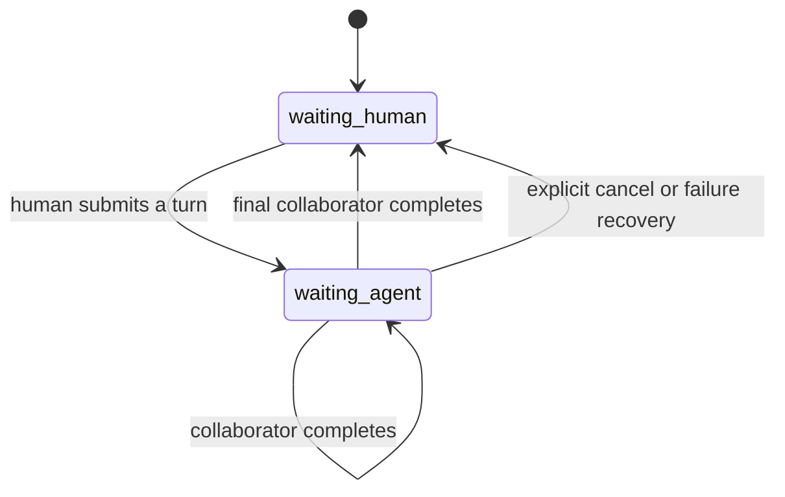

# Sequential three-agent room

## Goal

The default room order is deterministic:

```text
human -> first collaborator -> second collaborator -> human
```

The reference labels are Claude and Codex, but the state machine is vendor-neutral. Each participant points to a registered provider adapter or, in a later milestone, a local worker profile.

The room is not an infinite autonomous group chat. One human message creates at most one response per enabled participant and then returns control to the human.

## Current alpha behavior

Implemented:

- room and ordered participant persistence
- sequential provider execution
- deterministic delivery request IDs
- one human, first collaborator, second collaborator message order
- duplicate human request replay without duplicate provider calls
- delivery state persistence
- failed turn persistence
- API tests with fake providers

Not yet implemented:

- dispatching room turns to real outbound CLI workers
- streaming room deltas
- lease renewal and cursor replay
- manual skip/cancel/retry endpoints
- room rolling summaries and memory-candidate review
- production frontend

## State machine



Production deployments may expose more specific UI states such as `waiting_claude` and `waiting_codex`, while retaining the same database invariants.

## Request identities

Human turn:

```text
request_id = client-generated stable ID
```

Agent delivery:

```text
agent-room:{room_id}:{turn_id}:{agent_id}:{attempt}
```

Database uniqueness must protect both IDs. Process-local locks are not sufficient.

## Context ownership

The Hub owns the common identity and memory package.

First collaborator receives:

```text
stable persona
relevant long-term memories
room rolling summary
recent room messages
current human message
role: propose the first solution
```

Second collaborator receives all of the above plus the first collaborator's current response and a role such as:

```text
Review, complete, or challenge the first response, then stop.
```

Neither collaborator should wake the other. The Room Core advances the state machine.

## Persistence

The alpha schema contains:

- `agent_rooms`
- `agent_room_participants`
- `agent_room_turns`
- `agent_room_messages`
- `agent_room_deliveries`

Production extensions should add:

- per-consumer cursors
- replayable stream event rows or a bounded event log
- room result summaries
- reviewed memory candidates
- token and cost accounting

## Failure rules

### Frontend reconnect

Reconnect subscribes to the existing turn. It never submits the human message again.

### Worker disconnect

The delivery remains persisted. The UI offers retry, skip, or cancel after lease expiry. Automatic failover is only allowed when it cannot produce a second paid invocation.

### Provider failure

Persist the provider error and mark the turn failed. Retrying creates a new attempt and a new deterministic delivery ID.

### Duplicate event

Events carry a monotonically increasing sequence number. A sequence already committed is ignored.

### Human interruption

Cancellation is explicit and persisted. A late provider result is recorded as late/cancelled and cannot advance the room.

## Memory boundary

Do not write the complete internal debate into long-term memory.

At turn completion, produce a small result object:

```json
{
  "summary": "The room selected a lease-based retry design.",
  "decisions": ["Persist request IDs", "Never retry from a status probe"],
  "open_questions": ["Choose the stream event retention period"],
  "memory_candidate": null
}
```

Only reviewed, durable facts become long-term memories. Ordinary work outcomes belong in a short-lived work timeline or Code Bridge.

## Rollout plan

1. Run 20 sequential turns with fake providers.
2. Inject duplicate submissions, timeouts, and process restarts.
3. Connect the first real CLI worker in an isolated profile.
4. Connect the second real CLI worker.
5. Add streaming, leases, cursors, skip, cancel, and retry.
6. Add the mobile room UI.
7. Add room summary and memory-candidate review.
8. Verify provider call count and actual billing for every fault test.

## Open-source references

- [agentchattr](https://github.com/bcurts/agentchattr) for MCP messaging, cursors, and loop protection
- [Agent Room](https://github.com/agent-room-alkl/agent-room) for sequential state and turn leases
- [A2A](https://github.com/a2aproject/A2A) for cross-agent task interoperability
- [AG-UI](https://github.com/ag-ui-protocol/ag-ui) for agent-to-frontend event streams

Persona Hub should borrow protocol ideas, not introduce a second long-term identity or message database.
